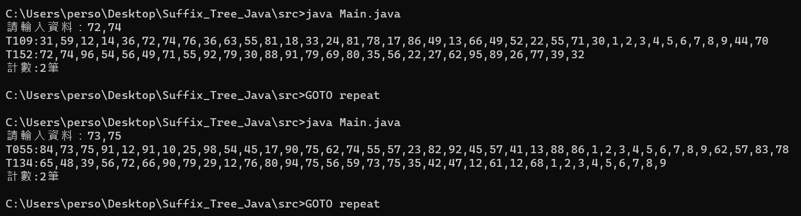

# **112資料探勘期末專題程式報告**
### **學生：** 1410932028 張郢橦
### **演算法：** Suffix Tree
### **程式語言：** Java

</br>

## **功能要求**
輸入一列數字，不同數字組間用`,`相隔開，與`t2.txt`的格式相同。 \
若經過Suffix Tree運算後，每個`t2.txt`內的資料組有找到相對應的數據的話，則**印出該筆資料組**，若**沒有則不印出**。

</br>

## **使用教學**
開啟`/src`資料夾，執行`runSuffix.bat`批次檔，或者開啟Windows Powershell等終端應用程式，並輸入以下指令：

```cmd
java Main.java
```
成功執行程式後，稍等一段時間，即會出現以下字串
```
請輸入資料：
```
此時即可輸入資料集，資料集的格式如下：
```
1,2,3,4,5
```
單筆資料與其他資料之間使用`,`隔開

</br>

`runSuffix.bat`之批次檔命令如下
```bat
:repeat
java Main.java

GOTO repeat
```
因此在每次使用過後，Windows會執行迴圈再呼叫一次程式 \
實現重複使用功能，但對於Java本程式而言，每次的運算都是獨立的

</br>

## **實際使用情況**



如上圖釋例，輸入資料後會印出有找到相對資料的資料集 \
全部印出後，會顯示找到的資料集(count)數量 \
由於每次使用
